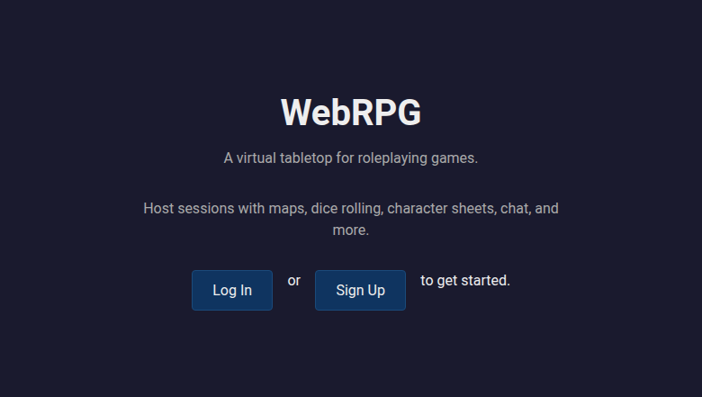
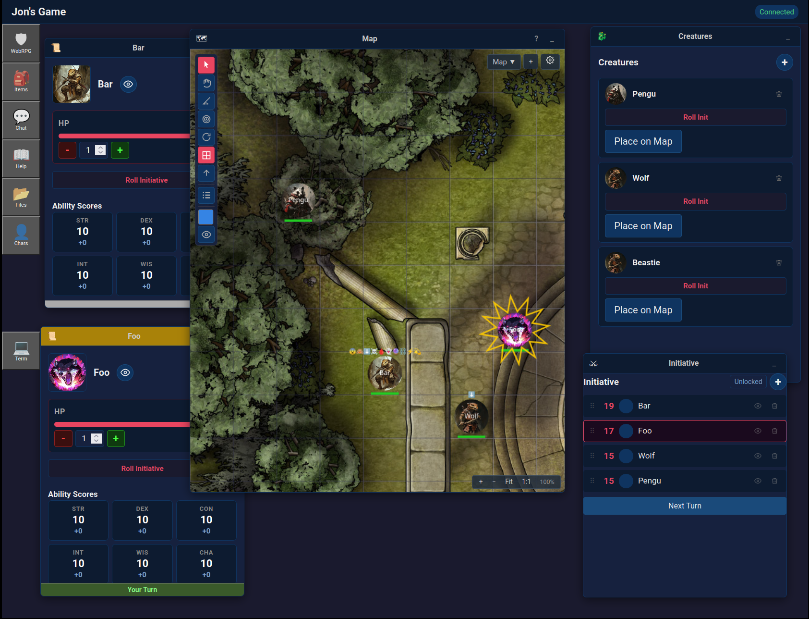

# WebRPG

[](https://github.com/OrangeTide/WebRPG/actions/workflows/pr.yml)
[](https://github.com/OrangeTide/WebRPG/actions/workflows/release.yml)
[](https://opensource.org/license/mit-0)
[](https://www.rust-lang.org/)
[](https://leptos.dev/)
[](https://docs.anthropic.com/en/docs/claude-code)

A virtual tabletop for roleplaying games, built with Rust.

WebRPG hosts multiplayer RPG sessions with real-time synchronization over
WebSockets.

### Features

- Grid maps with fog of war and background images
- Token placement with drag-and-drop movement and HP tracking
- Dice rolling with `NdN+M` notation
- Template-driven character sheets with resource tracking
- Creature stat blocks (GM only)
- Chat with dice roll integration
- Initiative tracking with turn order
- Party inventory management
- Media upload and content-addressable storage
- Multi-window UI with draggable, resizable panels

## Screenshots


*Landing page*


*Game session — GM view with map, character sheets, creatures, and initiative tracker*

## Prerequisites

- Rust (stable, 1.85+)
- `wasm32-unknown-unknown` target: `rustup target add wasm32-unknown-unknown`
- `cargo-leptos`: `cargo install cargo-leptos`
- SQLite3 development libraries (e.g. `libsqlite3-dev` on Debian/Ubuntu)
- Diesel CLI: `cargo install diesel_cli --no-default-features --features sqlite`

## Setup

```sh
git clone https://github.com/OrangeTide/WebRPG.git
cd WebRPG

# Create .env
cat > .env <<EOF
DATABASE_URL=database.db
SECRET_KEY=change-me-in-production
EOF

# Run database migrations
diesel migration run
```

## Running

```sh
# Development server with hot-reload
cargo leptos serve

# Then open http://localhost:3000
```

For a release build:

```sh
cargo leptos build --release
```

The output is a server binary at `target/server/release/webrpg` and static
assets in `target/site/`. To deploy, copy both and set these environment
variables:

```sh
LEPTOS_OUTPUT_NAME=webrpg
LEPTOS_SITE_ROOT=site
LEPTOS_SITE_PKG_DIR=pkg
LEPTOS_SITE_ADDR=0.0.0.0:3000
DATABASE_URL=database.db
SECRET_KEY=your-secret-key
```

For deployment with the included build and deploy scripts, see
[DEV.md — Deployment](DEV.md#deployment).

Reference configuration for nginx is provided at [doc/nginx/webrpg](doc/nginx/webrpg).

## Contributing

See [DEV.md — Contributing](DEV.md#contributing) for code standards, PR
guidelines, and commit message conventions.

## License

This project is licensed under [MIT-0](LICENSE) — a permissive license with no
attribution requirement.

## Testing

```sh
cargo test --features ssr
```

See [DEV.md — Testing](DEV.md#testing) for details on test coverage.

## More Information

See [DEV.md](DEV.md) for architecture, project structure, CI/CD, and testing
details.
